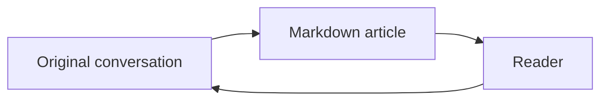

## A readable knowledge record

Good documentation connects an explanation to its evidence. It should work on a phone in the field and a large screen at a desk. Visit https://example.org for an ordinary automatic link, or follow a [reference note][reference].

> [!NOTE]
> This example uses synthetic information. The Markdown remains the authoritative source.

> [!TIP]
> Press **Search** to open search. Use the arrow keys to switch content tabs.

### Structured information

| Area      | Outcome                                       | Status    |
| --------- | --------------------------------------------- | --------- |
| Research  | Keep evidence linked to each decision         | Active    |
| Interface | Reflow from a narrow phone to a large desktop | In review |

- [x] Preserve original records
- [ ] Review the next experiment
- [w] Improve the reading experience

~~An earlier plan~~ has been replaced by a smaller pilot.[^decision]

### Math and code

The relationship $E = mc^2$ can be expressed inline. A display equation is useful for a derivation:

$$
\int_0^1 x^2 \, dx = \frac{1}{3}
$$

```javascript
function recordDecision(title, evidence) {
  return { title, evidence, status: "recorded" };
}
```



### More detail when needed

:::details{title="Why the original source matters"}
A summary is useful, but the original record lets a reader check what was actually said.

This paragraph remains searchable even when the disclosure is closed.
:::

::::tabs
:::tab{title="Read"}
Read the explanation, follow a citation, and inspect the original conversation.
:::
:::tab{title="Edit"}
Write a new explanation, preview the Markdown, and save a revision with a useful summary.
:::
::::

::::figure
An original image can be included with the wiki's captured-media Markdown syntax.

:::caption
Figure 1. Captions stay next to their content on every screen size.
:::
::::

[reference]: https://example.org/reference

[^decision]: A footnote gives a short explanation without interrupting the main text.
